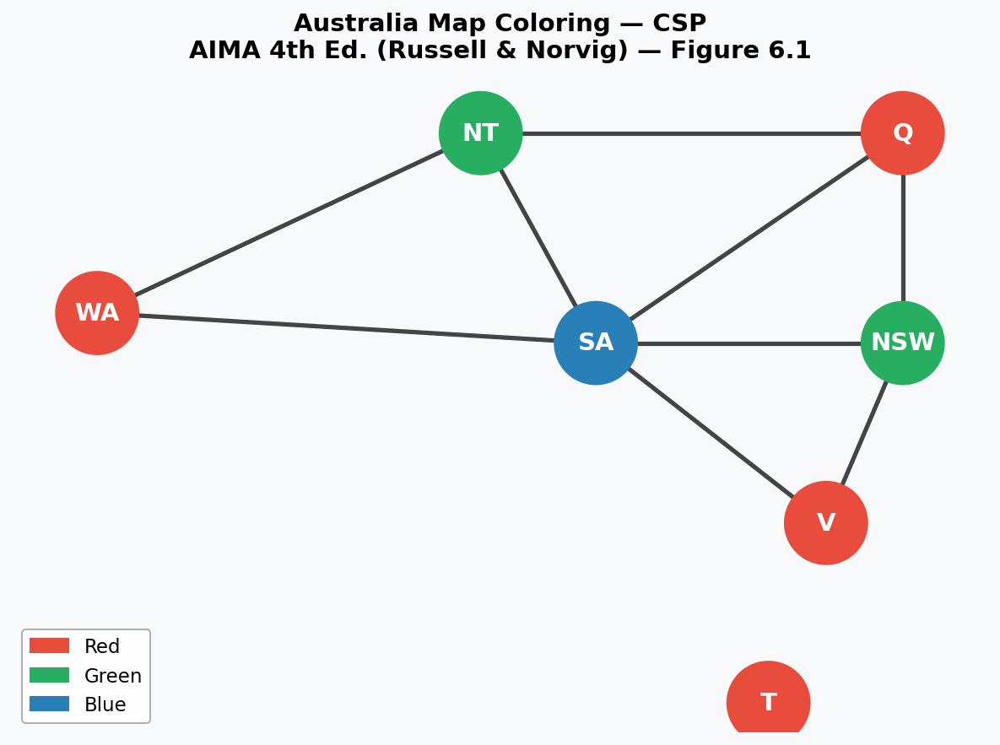
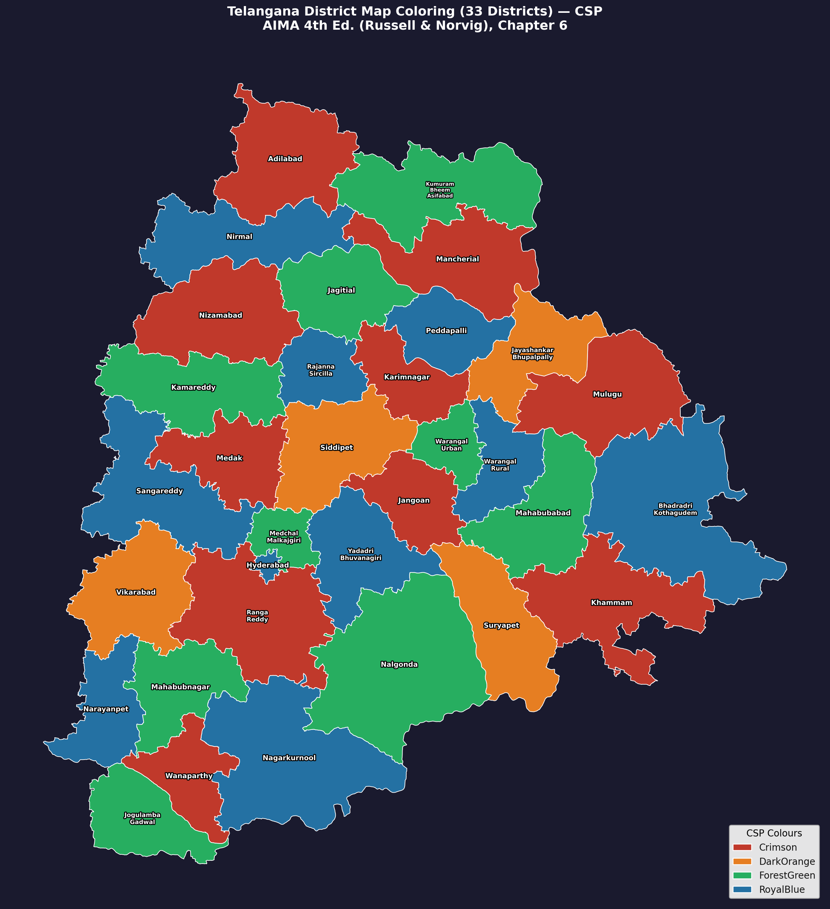

# AI_Assignment_4 — Constraint Satisfaction Problems(CSP)

**Reference:** Artificial Intelligence: A Modern Approach (4th Edition)  
Stuart Russell & Peter Norvig, Pearson — Chapter 6

---

## Project Structure

```
CSP-Assignment/
│
├── 01_australia_map_coloring.py      # Problem 1 — Australia map coloring
├── 01_australia_map_coloring.png     # Output visualization
│
├── 02_telangana_map_coloring.py      # Problem 2 — Telangana district coloring
├── 02_telangana_map_coloring.png     # Output visualization
├── TELANGANA_DISTRICTS.geojson       # Real district boundary data
│
├── 03_sudoku_csp.py                  # Problem 3 — Sudoku solver
├── 03_sudoku.png                     # Output visualization
│
├── 04_cryptarithmetic_csp.py         # Problem 4 — TWO + TWO = FOUR
├── 04_cryptarithmetic.png            # Output visualization
│
└── README.md                         # This file
```

---

## Requirements

```
pip install matplotlib networkx geopandas
```

| Library | Used For |
|---------|----------|
| `matplotlib` | All visualizations |
| `networkx` | Constraint graph drawing (Problem 1) |
| `geopandas` | Real geographic map rendering (Problem 2) |

---

## How to Run

```
python 01_australia_map_coloring.py
python 02_telangana_map_coloring.py
python 03_sudoku_csp.py
python 04_cryptarithmetic_csp.py
```

Each script prints the solution to the terminal and saves a `.png` visualization in the same folder.

> **Note for Problem 2:** Place `TELANGANA_DISTRICTS.geojson` in the same folder as the script before running.

---

## What is a CSP?

A **Constraint Satisfaction Problem (CSP)** is defined by three things:

| Component | Meaning |
|-----------|---------|
| **Variables** X = {X₁, X₂, ..., Xₙ} | The things we need to assign values to |
| **Domains** D = {D₁, D₂, ..., Dₙ} | The set of possible values for each variable |
| **Constraints** C | Rules that restrict which value combinations are allowed |

A solution is a complete, consistent assignment — every variable has a value and no constraint is violated.

---

## CSP Framework — Algorithms Used

Every problem uses the same generic `CSP` class with the following algorithms:

### 1. Backtracking Search *(AIMA Figure 6.5)*

Depth-first search that assigns one variable at a time and **backtracks** when no legal value remains for the current variable.

```
function BACKTRACKING-SEARCH(csp):
    return BACKTRACK({}, csp)

function BACKTRACK(assignment, csp):
    if assignment is complete → return assignment
    var ← SELECT-UNASSIGNED-VARIABLE(csp, assignment)
    for each value in DOMAIN(var):
        if value is consistent with assignment:
            add {var = value} to assignment
            result ← BACKTRACK(assignment, csp)
            if result ≠ failure → return result
        remove {var = value} from assignment
    return failure
```

### 2. MRV Heuristic — Minimum Remaining Values *(AIMA §6.3.1)*

Instead of picking any unassigned variable, MRV always picks the one with the **fewest legal values left** in its domain. This catches failures as early as possible.

```
var = argmin  |domain(v)|
      v ∉ assignment
```

**Why it helps:** If a variable is already down to 1 legal value, assign it now before wasting effort on other branches.

### 3. Forward Checking *(AIMA §6.3.2)*

After assigning a value to variable X, look ahead at every **unassigned neighbour** Y and remove from Y's domain any value that conflicts with X's assignment.

```
for each unassigned neighbour Y of X:
    remove from domain(Y) any value v where constraint(X, assigned_val, Y, v) = false
    if domain(Y) becomes empty → backtrack immediately
```

**Why it helps:** Detects dead-end branches early without waiting until the affected variable is actually chosen.

---

## Problem 1 — Australia Map Coloring

### Problem Statement
Assign a colour to each of the 7 Australian states and territories so that **no two neighbouring regions share the same colour** *(AIMA Figure 6.1)*.

### CSP Formulation

| | Detail |
|--|--------|
| **Variables** | WA, NT, Q, SA, NSW, V, T |
| **Domain** | {Red, Green, Blue} |
| **Constraint** | For every shared border: colour(A) ≠ colour(B) |

### Adjacency (Constraint Graph Edges)
```
WA  — NT, SA
NT  — WA, Q, SA
Q   — NT, SA, NSW
SA  — WA, NT, Q, NSW, V
NSW — Q, SA, V
V   — SA, NSW
T   — (none — island, no land borders)
```

### Constraint Formula
```
∀ adjacent regions (A, B):  colour(A) ≠ colour(B)
```

### Solution
```
WA=Red   NT=Green   Q=Red   SA=Blue   NSW=Green   V=Red   T=Red
```



---

## Problem 2 — Telangana Map Coloring (33 Districts)

### Problem Statement
Same idea as Problem 1 but scaled to all **33 districts of Telangana**. Assign colours so that no two geographically adjacent districts share the same colour.

### CSP Formulation

| | Detail |
|--|--------|
| **Variables** | 33 Telangana districts |
| **Domain** | {Crimson, ForestGreen, RoyalBlue, DarkOrange, MediumOrchid, DeepSkyBlue} |
| **Constraint** | Adjacent districts must have different colours |

### Constraint Formula
```
∀ adjacent districts (A, B):  colour(A) ≠ colour(B)
```

### Why 6 Colours?
The **Four Colour Theorem** guarantees any planar map needs at most 4 colours. 6 colours are used here to give the solver more freedom and make the output visually clearer and more distinct.

### Districts Covered (all 33)
Adilabad, KumurambheemAsifabad, Mancherial, Nirmal, Nizamabad, Jagtial, Peddapalli, JayashankarBhupalpally, RajannaSircilla, Karimnagar, Kamareddy, Medak, Sangareddy, Siddipet, Jangaon, WarangalUrban, WarangalRural, Mulugu, BhadradriKothagudem, Khammam, Mahabubabad, Suryapet, Nalgonda, YadadriBhuvanagiri, MedchalMalkajgiri, Hyderabad, Rangareddy, Vikarabad, Mahabubnagar, Nagarkurnool, Wanaparthy, JogulumbaGadwal, Narayanpet.

**Key implementation detail:**
District adjacency is **computed directly from geographic geometry** using the GeoJSON boundary data — not typed manually. Two distr>

```python
shared = geom1.intersection(geom2)
if shared.geom_type not in ('Point', 'MultiPoint') and not shared.is_empty:
    adjacency[d1].append(d2)
```

The output uses real-world district boundaries from the GeoJSON file, rendered using `geopandas`.



---

## Problem 3 — Sudoku *(AIMA §6.1.2, Figure 6.4)*

### Problem Statement
Fill a 9×9 grid with digits 1–9 such that every **row**, every **column**, and every **3×3 box** contains each digit exactly once.

### CSP Formulation

| | Detail |
|--|--------|
| **Variables** | 81 cells labelled A1 to I9 (row letter + column number) |
| **Domain** | {1–9} for empty cells; single fixed value for pre-filled cells |
| **Constraints** | All-different within each row + each column + each 3×3 box |

### Neighbour Definition
Two cells are **neighbours** (constrained against each other) if they share:

```
same row:  cell[A] and cell[B] have the same row letter
same col:  cell[A] and cell[B] have the same column number
same box:  floor(row_index / 3) and floor(col_index / 3) are both equal
```

### Constraint Formula
```
∀ neighbours (A, B):  value(A) ≠ value(B)
```

Each cell has up to **20 neighbours** (8 in same row + 8 in same column + 8 in same box, minus overlaps at intersections).

### Puzzle Used *(AIMA Figure 6.4a)*
```
     1  2  3   4  5  6   7  8  9
     ---------------------------
 A | .  .  3 | .  2  . | 6  .  . |
 B | 9  .  . | 3  .  5 | .  .  1 |
 C | .  .  1 | 8  .  6 | 4  .  . |
     ---------------------------
 D | .  .  8 | 1  .  2 | 9  .  . |
 E | 7  .  . | .  .  . | .  .  8 |
 F | .  .  6 | 7  .  8 | 2  .  . |
     ---------------------------
 G | .  .  2 | 6  .  9 | 5  .  . |
 H | 8  .  . | 2  .  3 | .  .  9 |
 I | .  .  5 | .  1  . | 3  .  . |
```

### Solution *(AIMA Figure 6.4b)*
```
     1  2  3   4  5  6   7  8  9
     ---------------------------
 A | 4  8  3 | 9  2  1 | 6  5  7 |
 B | 9  6  7 | 3  4  5 | 8  2  1 |
 C | 2  5  1 | 8  7  6 | 4  9  3 |
     ---------------------------
 D | 5  4  8 | 1  3  2 | 9  7  6 |
 E | 7  2  9 | 5  6  4 | 1  3  8 |
 F | 1  3  6 | 7  9  8 | 2  4  5 |
     ---------------------------
 G | 3  7  2 | 6  8  9 | 5  1  4 |
 H | 8  1  4 | 2  5  3 | 7  6  9 |
 I | 6  9  5 | 4  1  7 | 3  8  2 |
```

---

## Problem 4 — Cryptarithmetic: TWO + TWO = FOUR *(AIMA Figure 6.2a)*

### Problem Statement
Each letter represents a **unique digit (0–9)**. Find the substitution such that the addition is arithmetically correct. No leading zeros allowed (T ≠ 0 and F ≠ 0).

```
    T  W  O
  + T  W  O
   ---------
  F  O  U  R
```

### CSP Formulation

| | Detail |
|--|--------|
| **Variables** | T, W, O, F, U, R (digit variables) + C1, C2, C3 (carry bits) |
| **Domain** | Letters: {0, 1, ..., 9} · Carries C1, C2, C3: {0, 1} |
| **Constraints** | Column equations + all letters distinct + no leading zeros |

### Column-by-Column Decomposition

The addition is split into 4 columns from **right to left**. Each column produces a digit and a **carry** into the next column:

```
Column 1 (ones place):
    O + O = R + 10·C1
    → C1 is the carry out of column 1

Column 2 (tens place):
    W + W + C1 = U + 10·C2
    → C2 is the carry out of column 2

Column 3 (hundreds place):
    T + T + C2 = O + 10·C3
    → C3 is the carry out of column 3

Column 4 (thousands place):
    C3 = F
    → The final carry becomes the leading digit F
```

### Additional Constraints
```
T ≠ 0                          (no leading zero in TWO)
F ≠ 0                          (no leading zero in FOUR)
T, W, O, F, U, R all distinct  (each letter maps to a unique digit)
```

### Why Carry Variables?
Standard binary CSP constraints link exactly **2 variables**. Each column equation here involves **3 or 4 variables**. By introducing auxiliary carry variables C1, C2, C3, each column equation can be checked as soon as all its variables are assigned — this is the auxiliary variable technique described in **AIMA §6.1.4**.

### Solution
```
T=7   W=3   O=4   F=1   U=6   R=8
Carries:  C1=0   C2=0   C3=1

    7  3  4
  + 7  3  4
   ---------
  1  4  6  8

  734 + 734 = 1468  ✓
```

---

## Summary Table

| # | Problem | Variables | Domain | Key Constraint | Result |
|---|---------|-----------|--------|----------------|--------|
| 1 | Australia Map Coloring | 7 regions | 3 colours | Adjacent ≠ same colour | Solved with 3 colours |
| 2 | Telangana Map Coloring | 33 districts | 6 colours | Adjacent ≠ same colour | Solved with 4 colours |
| 3 | Sudoku | 81 cells | digits 1–9 | Row / Col / Box all-different | Matches AIMA Fig 6.4b |
| 4 | Cryptarithmetic | 9 variables | digits 0–9 | Column equations + distinct | 734 + 734 = 1468 |# CSP-Assignment
Constraint Satisfaction Problems (AIMA)
